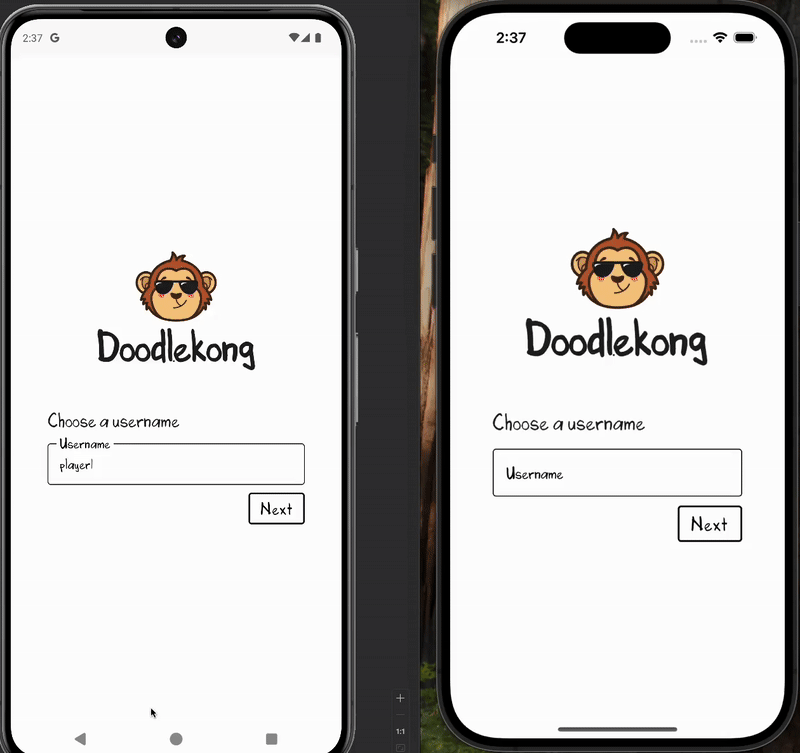

This is a Kotlin Multiplatform project targeting Android, iOS.

* `/composeApp` is for code that will be shared across your Compose Multiplatform applications.
  It contains several subfolders:
  - `commonMain` is for code that’s common for all targets.
  - Other folders are for Kotlin code that will be compiled for only the platform indicated in the folder name.
    For example, if you want to use Apple’s CoreCrypto for the iOS part of your Kotlin app,
    `iosMain` would be the right folder for such calls.

* `/iosApp` contains iOS applications. Even if you’re sharing your UI with Compose Multiplatform, 
  you need this entry point for your iOS app. This is also where you should add SwiftUI code for your project.


Learn more about [Kotlin Multiplatform](https://www.jetbrains.com/help/kotlin-multiplatform-dev/get-started.html)…

# **DoodleKong**  

A fast-paced drawing and guessing game.  

## ✨ Features app
✅ Real-time game
✅ Multiplayer
✅ Chat for players

## **Demo**  

<p align="center">
  
</p>

## **Installation**  

1. **Clone and run the server:**  
   First, clone and start the server from the [DoodleKong Server](https://github.com/JesusHzC/ktor-doodlekong) repository.  

2. **Update network constants:**  
   In the `NetworkConstants` file, replace the following values with your local IP address:  

   ```kotlin
   const val BASE_URL = "http://YOUR_LOCAL_IP:8080"
   const val SOCKET_URL = "ws://YOUR_LOCAL_IP:8080/ws/draw"
